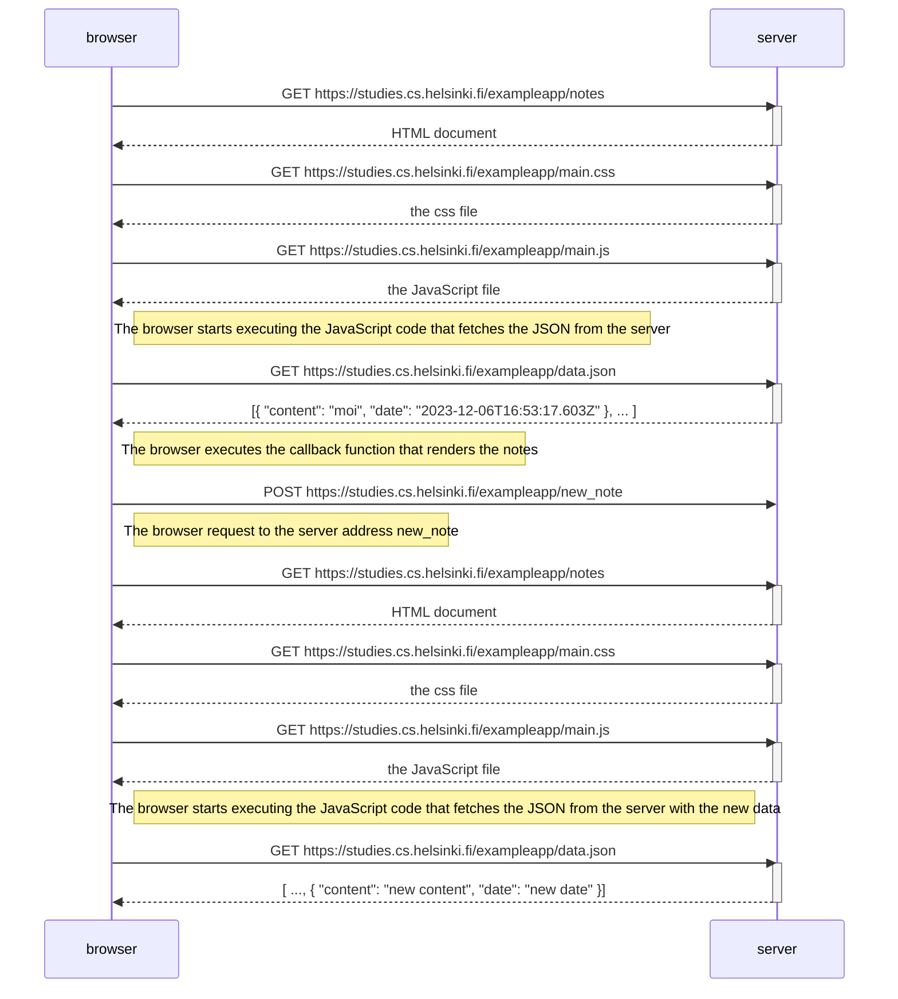

```mermaid
sequenceDiagram
    participant browser
    participant server

    browser->>server: GET https://studies.cs.helsinki.fi/exampleapp/notes
    activate server
    server-->>browser: HTML document
    deactivate server

    browser->>server: GET https://studies.cs.helsinki.fi/exampleapp/main.css
    activate server
    server-->>browser: the css file
    deactivate server

    browser->>server: GET https://studies.cs.helsinki.fi/exampleapp/main.js
    activate server
    server-->>browser: the JavaScript file
    deactivate server

    Note right of browser: The browser starts executing the JavaScript code that fetches the JSON from the server

    browser->>server: GET https://studies.cs.helsinki.fi/exampleapp/data.json
    activate server
    server-->>browser: [{ "content": "moi", "date": "2023-12-06T16:53:17.603Z" }, ... ]
    deactivate server

    Note right of browser: The browser executes the callback function that renders the notes

    browser->>server: POST https://studies.cs.helsinki.fi/exampleapp/new_note

    Note right of browser: The browser request to the server address new_note

    browser->>server: GET https://studies.cs.helsinki.fi/exampleapp/notes
    activate server
    server-->>browser: HTML document
    deactivate server

    browser->>server: GET https://studies.cs.helsinki.fi/exampleapp/main.css
    activate server
    server-->>browser: the css file
    deactivate server

    browser->>server: GET https://studies.cs.helsinki.fi/exampleapp/main.js
    activate server
    server-->>browser: the JavaScript file
    deactivate server

    Note right of browser: The browser starts executing the JavaScript code that fetches the JSON from the server with the new data

    browser->>server: GET https://studies.cs.helsinki.fi/exampleapp/data.json
    activate server
    server-->>browser: [ ..., { "content": "new content", "date": "new date" }]
    deactivate server
```
